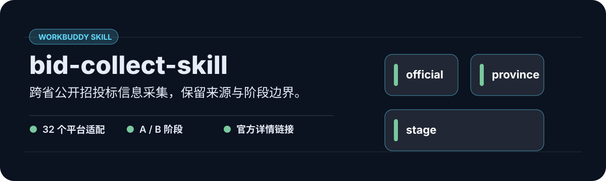

<p align="center">
  
</p>

面向公共资源交易平台的可审计采集技能。它区分代码适配、当前可达与本次验证，不把缺失或受限伪装成成功。

## 一眼看懂

| 价值 | 真实证据 |
| --- | --- |
| 跨省公开招标公告采集，保留来源与状态边界。 | 32 个平台适配 · 官方详情链接 · 标标通 16 列 |

## 从这里开始

```text
node scripts/self-test.cjs
```

## 完整说明

WorkBuddy 技能：跨省公共资源交易平台招投标公告采集器。覆盖 **32 个省/市级交易平台**，按「家族」逆向适配，支持招标公告、中标候选、中标结果与合同阶段。

## 能力现状（2026-08-15）

本 PR 的全国实时状态总账与分层验收只计招标公告（`zb`）；候选/中标/合同继续作为现有公开能力保留，但不以本 PR 的 zb 实测结果替它们背书全国准确率。各阶段实际覆盖以 `reference/FAMILY_INDEX.md` 为准。

## 架构

- `scripts/province-collect.cjs` —— 主采集器（CLI：`node province-collect.cjs -p <adapter> -k 管网 --detail -d 30 --csv`）。
- `scripts/ygp-collect.cjs` —— 广东粤公平（ygp）独立 API 采集器。
- `scripts/domains-31.csv` —— 31 省交易平台权威域名清单。
- `reference/CITY_ENTRY_INDEX.md` —— 32 省城市/区县入口口径与已实测样本。
- `reference/ZB_LIVE_STATUS_2026-08-15.md` —— 32 省招标公告实时状态快照（只记录 zb）。
- `reference/*.md` —— 各省适配注记（前端 JS 逆向结论、栏目码、坑）。
- `SKILL.md` —— 技能使用说明与调度协议。

## 标标通兼容输出

```bash
node scripts/province-collect.cjs -p anhui -d 30 --limit 20 --detail \
  --xlsx-layout biaobiaotong16 --out out/anhui.xlsx
```

`biaobiaotong16` 固定生成 `房建市政 / 水利 / 公路 / 其他项目` 4 个 sheet，并严格使用参考工作簿的 16 列顺序；工作簿内置表头样式、列宽、自动换行、首行冻结和筛选。

指定 `--out` 时同时生成同目录 `<输出文件名>.run-report.json`，记录 `snapshot_at`、来源、参数、数量、状态和错误；空结果标为 `CONNECTED_NO_RECENT_DATA`，不与 `FAILED` 混淆。

## 阶段选择

```bash
node scripts/province-collect.cjs -p hainan --stage candidate -d 120 --limit 20 --out out/hainan-candidate.xlsx
node scripts/province-collect.cjs -p hainan --stage result -d 120 --limit 20 --out out/hainan-result.xlsx
node scripts/province-collect.cjs -p hainan --stage contract -d 120 --limit 20 --out out/hainan-contract.xlsx
```

不传 `--stage` 时默认 `zb`。B 阶段栏目不能跨省盲推；只运行对应 adapter 已在 `stages` 中明确配置的阶段。

## 城市/区县筛选

```bash
node scripts/province-collect.cjs -p hainan -c "海口,文昌" -k 管网 -d 30 --detail --out out/hainan-city.xlsx
```

`-c, --city` 支持城市或区县简称、全称及逗号/顿号 OR。由于各省服务端的行政区字段不统一，采集器在客户端对平台地区、标题和提取地点做匹配；留空或传入 `全省` 表示不过滤。

## 提交前验证

```bash
node --check scripts/province-collect.cjs
node scripts/self-test.cjs
```

GitHub Actions 会对每个 PR 自动运行以上离线回归；真实站点 smoke test 仍需本地执行并在 PR 中记录采样时间和条数。

## 本地开发双副本纪律

技能副本（`~/.workbuddy/skills/collect-bid-notices/`）与项目工作副本（`E:/工程项目/_工具脚本/bid-collect/`）**必须保持一致**：

```bash
# 编辑后同步 + 校验
cp province-collect.cjs <skill>/scripts/province-collect.cjs
node --check province-collect.cjs && node --check <skill>/scripts/province-collect.cjs
diff -q province-collect.cjs <skill>/scripts/province-collect.cjs   # 须 IDENTICAL
```

## 协作（Codex / Claude Code）

本仓库用于多 AI 协作完善：
- **Issue**：报告某省公告入口、阶段路由、字段抽取噪声、城市筛选或新省适配问题。
- **PR**：修复 `list`/`parse`/详情函数、补充 `reference/*.md` 的实测证据。
- 提交前请确保双副本一致，且语法检查与 `scripts/self-test.cjs` 全部通过。

## 代理

部分省 HTTPS TLS 失败需改 HTTP 兜底；联网采集经 `HTTPS_PROXY=http://127.0.0.1:7897`（本地代理，非仓库内容）。
