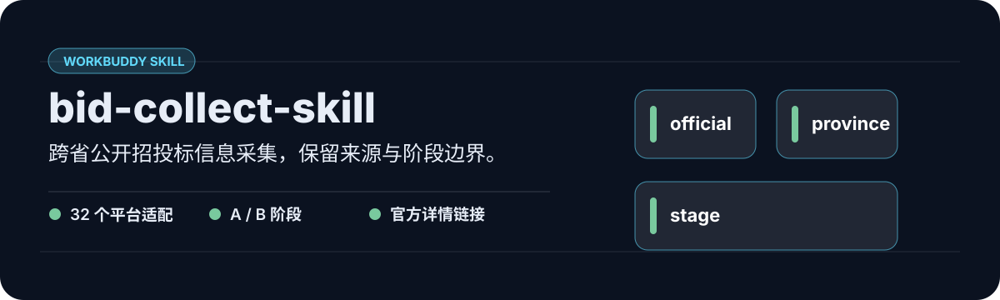

<p align="center">
  
</p>

面向公共资源交易平台的可审计采集技能。它区分代码适配、当前可达与本次验证，不把缺失或受限伪装成成功。

## 一眼看懂

| 价值 | 真实证据 |
| --- | --- |
| 跨省公开招标公告采集，保留来源与状态边界。 | 32 个平台适配 · 官方详情链接 · project18 项目判断表 · 标标通 16 列兼容 |

## 从这里开始

```text
node scripts/self-test.cjs
```

## 完整说明

WorkBuddy 技能：跨省公共资源交易平台招投标公告采集器。覆盖 **32 个省/市级交易平台**，按「家族」逆向适配，支持招标公告、中标候选、中标结果与合同阶段。

## 能力现状（2026-08-23）

本 PR 的全国实时状态总账与分层验收只计招标公告（`zb`）；候选/中标/合同继续作为现有公开能力保留，但不以本 PR 的 zb 实测结果替它们背书全国准确率。各阶段实际覆盖以 `reference/FAMILY_INDEX.md` 为准。

project18 全国分批推进已于 2026-08-22 完成：62个 adapter ×17字段共1,054格均有可审计终态，`FIELD_UNVERIFIED=0`。终态包含已验证、失败、OCR、无样本、未披露和受限；这表示全国支持 project18 输出并可审计，不表示每列均有值。

2026-08-23 全国准确率验收使用冻结100条官方 `zb` 公告：阶段负例2/2拒绝，标题、发布日期、官方链接和地区共400/400正确；详情字段总体 union accuracy 99.42%、precision 99.59%、recall 99.42%，每个 `n≥20` 字段三项指标均不低于95%，`controlPrice` 估算/预算语义假阳性为0。另以30个不同 adapter、12个平台家族做前向盲测，硬字段120/120、源页披露且纳入核对的详情事实258/258正确。完整机器证据见 `reference/evidence/nationwide-100-final-and-blind30-v2.json`。

上述结论是抽样验收，不表示全国每条公告、每个字段均非空或零缺陷。冻结集仍保留7个已知残差；源站未披露、扫描 PDF、乱码文本、附件受限和页面只给跳转入口时继续诚实留空或标记受限。

## 架构

- `scripts/province-collect.cjs` —— 主采集器（CLI：`node province-collect.cjs -p <adapter> -k 管网 --detail -d 30 --csv`）。
- `PROJECT18_CAPABILITIES.json` —— 62×17 字段能力机器真相源；运行状态不在这里维护。
- `scripts/project18-capabilities.cjs` —— 能力矩阵校验与 `COVERAGE_MATRIX.md` 投影生成器。
- `scripts/ygp-collect.cjs` —— 广东粤公平（ygp）独立 API 采集器。
- `scripts/domains-31.csv` —— 31 省交易平台权威域名清单。
- `reference/CITY_ENTRY_INDEX.md` —— 32 省城市/区县入口口径与已实测样本。
- `reference/ZB_LIVE_STATUS_2026-08-15.md` —— 32 省招标公告实时状态快照（只记录 zb）。
- `reference/*.md` —— 各省适配注记（前端 JS 逆向结论、栏目码、坑）。
- `SKILL.md` —— 技能使用说明与调度协议。

## 日常项目判断输出

```bash
node scripts/province-collect.cjs -p anhui -d 30 --limit 20 --detail --attach \
  --xlsx-layout project18 --out out/anhui.xlsx
```

`project18` 固定生成 4 个分类 sheet，在项目名称后展示“建设规模/招标范围”：前者描述整个项目做什么和规模多大，后者描述本次招标具体承包什么。两列只保留官方确定性事实，不生成 AI 摘要。

编号段和平台精确标签优先于扁平正文；采购需求、服务内容、代建范围默认进入“招标范围”，只有独立的数量、容量或物理规模事实才进入“建设规模”。两列内容相同或包含时执行去重，不把同一句复制两遍。

四个分类 Sheet 不再按“桥梁/管网”等单个词先到先得：明确市政道路、市政桥梁、市政供排水优先归“房建市政”；高速/国省道/农村公路和水库/灌区/堤防分别使用强公路、强水利语义。单次分类证据保存在 run-report 的 `signals.sheet_classifications[]`。

## 标标通兼容输出

```bash
node scripts/province-collect.cjs -p anhui -d 30 --limit 20 --detail \
  --xlsx-layout biaobiaotong16 --out out/anhui.xlsx
```

`biaobiaotong16` 固定生成 `房建市政 / 水利 / 公路 / 其他项目` 4 个 sheet，并严格使用参考工作簿的 16 列顺序；工作簿内置表头样式、列宽、自动换行、首行冻结和筛选。

指定 `--out` 时同时生成同目录 `<输出文件名>.run-report.json`，记录 `snapshot_at`、来源、参数、数量、状态和错误；空结果标为 `CONNECTED_NO_RECENT_DATA`，不与 `FAILED` 混淆。sidecar v1 兼容追加 `field_stats`，逐字段记录样本数、填充/空值和 `list/detail/attachment` 来源层；单次运行不会自动修改能力矩阵。

`controlPrice` 严格只收官方明确的最高投标限价、招标控制价、最高限价或投标报价上限。合同估算价、项目投资、工程造价、采购预算、发包估价及总价存在时的分项价不会进入业务表；拒绝事实只在 sidecar 的 `signals.price_rejections[]` 中保留标签、金额、来源层和原因码。

字段能力以 `PROJECT18_CAPABILITIES.json` 为准，`reference/COVERAGE_MATRIX.md` 只是人读投影。已验证状态必须引用干净代码证据；`code_dirty=true` 的 run-report 不能转正能力。当前1,054格均已有诚实终态，`FIELD_UNVERIFIED=0`；受限、OCR、无样本和未披露不等于提取成功，也不得改写成空值覆盖率。

## 阶段选择

```bash
node scripts/province-collect.cjs -p hainan --stage candidate -d 120 --limit 20 --out out/hainan-candidate.xlsx
node scripts/province-collect.cjs -p hainan --stage result -d 120 --limit 20 --out out/hainan-result.xlsx
node scripts/province-collect.cjs -p hainan --stage contract -d 120 --limit 20 --out out/hainan-contract.xlsx
```

不传 `--stage` 时默认 `zb`。B 阶段栏目不能跨省盲推；只运行对应 adapter 已在 `stages` 中明确配置的阶段。

默认 `zb` 同时执行标题层与详情层纯度检查：询比、磋商、谈判、询价、资格预审、更正和结果公告不得进入业务表；正文明确为资格预审时，即使列表标题只是项目名也会拒绝。阶段与地区拒绝证据分别写入 `signals.stage_rejections[]`、`signals.region_rejections[]`。30个城市 adapter 均使用显式 `cityName` 兜底，不从“公共资源交易平台/中心/门户/网站”等展示文本猜地区。

## 城市/区县筛选

```bash
node scripts/province-collect.cjs -p hainan -c "海口,文昌" -k 管网 -d 30 --detail --out out/hainan-city.xlsx
```

`-c, --city` 支持城市或区县简称、全称及逗号/顿号 OR。默认仍在客户端对平台地区、标题和提取地点做匹配；adapter 有经验证官方城市代码时（当前为广东粤公平），先下推地市范围再保留客户端区县过滤。留空或传入 `全省` 表示不过滤。

## 提交前验证

```bash
node --check scripts/province-collect.cjs
node --check scripts/project18-capabilities.cjs
node scripts/project18-capabilities.cjs --check
node scripts/project18-capabilities.cjs --require-complete
node scripts/self-test.cjs
```

GitHub Actions 会对每个 PR 自动运行以上离线回归；真实站点 smoke test 仍需本地执行并在 PR 中记录采样时间和条数。

## 本地开发双副本纪律

技能副本（`~/.workbuddy/skills/collect-bid-notices/`）与项目工作副本（`E:/工程项目/_工具脚本/bid-collect/`）**必须保持一致**：

```bash
# 编辑后同步 + 校验
cp province-collect.cjs <skill>/scripts/province-collect.cjs
node --check province-collect.cjs && node --check <skill>/scripts/province-collect.cjs
diff -q province-collect.cjs <skill>/scripts/province-collect.cjs   # 须 IDENTICAL
```

## 协作（Codex / Claude Code）

本仓库用于多 AI 协作完善：
- **Issue**：报告某省公告入口、阶段路由、字段抽取噪声、城市筛选或新省适配问题。
- **PR**：修复 `list`/`parse`/详情函数、补充 `reference/*.md` 的实测证据。
- 提交前请确保双副本一致，且语法检查与 `scripts/self-test.cjs` 全部通过。

## 代理

部分省 HTTPS TLS 失败需改 HTTP 兜底；联网采集经 `HTTPS_PROXY=http://127.0.0.1:7897`（本地代理，非仓库内容）。
